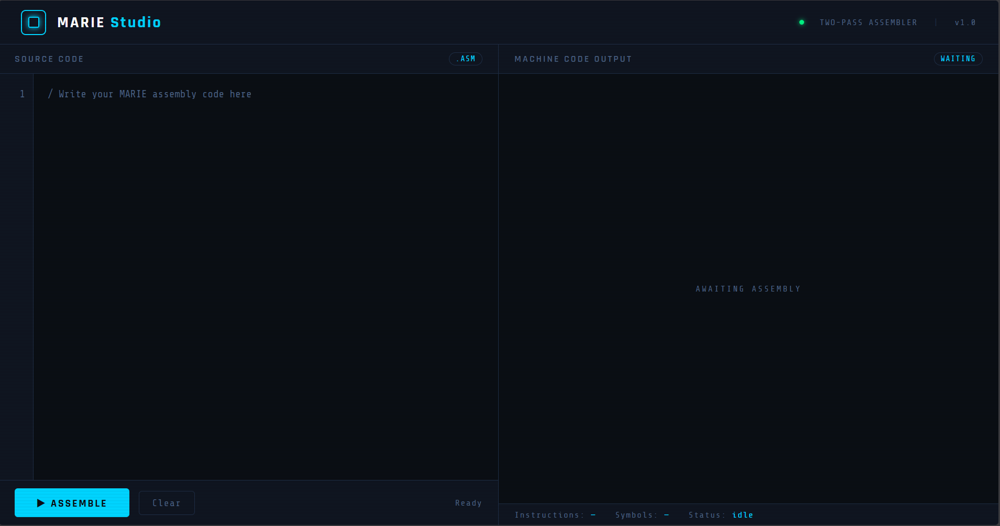
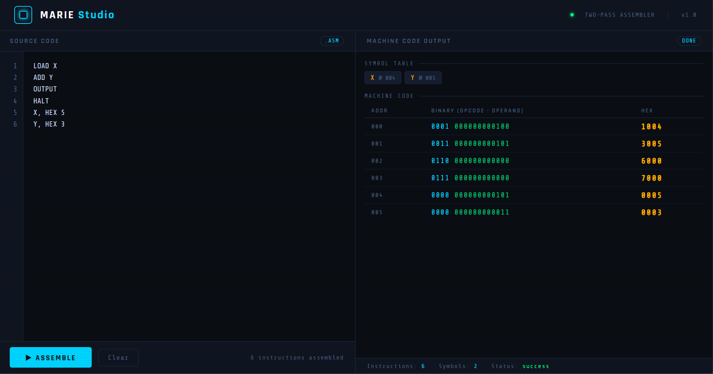

<div align="center">
# 🖥️ MARIE Studio
 
### A two-pass assembler for the MARIE architecture
*Translate MARIE assembly into binary and hexadecimal machine code, instantly.*
 


 
</div>
---
 
## 📸 Preview
 
<div align="center">
| Empty Editor | After Assembling |
|:---:|:---:|
|  |  |
 
</div>
 
---
 
## 📖 What is this?
 
**MARIE Studio** is a two-pass assembler built for the MARIE (Machine Architecture that is Really Intuitive and Easy) architecture. It converts MARIE assembly language source code into binary and hexadecimal machine code through a clean, browser-based GUI.
 
Built with Python and Flask as a university Computer Architecture project.
 
---
 
## ✨ Features
 
- ✅ Two-pass assembly — resolves forward label references correctly
- ✅ Supports all 12 MARIE instructions (basic + extended)
- ✅ Outputs both binary (16-bit) and hexadecimal machine code
- ✅ Displays symbol table with label addresses
- ✅ Clean error messages for unknown instructions
- ✅ Browser-based GUI with live line numbers
- ✅ Keyboard shortcut: `Ctrl+Enter` to assemble
---
 
## 🧠 Supported Instructions
 
| Instruction | Opcode | Operation |
|-------------|--------|-----------|
| `LOAD X`    | 0001   | AC ← M[X] |
| `STORE X`   | 0010   | M[X] ← AC |
| `ADD X`     | 0011   | AC ← AC + M[X] |
| `SUBT X`    | 0100   | AC ← AC − M[X] |
| `INPUT`     | 0101   | AC ← keyboard |
| `OUTPUT`    | 0110   | Print AC |
| `HALT`      | 0111   | Stop execution |
| `SKIPCOND`  | 1000   | Skip next if condition met |
| `JUMP X`    | 1001   | PC ← X |
| `LOADI X`   | 1010   | AC ← M[M[X]] |
| `STOREI X`  | 1011   | M[M[X]] ← AC |
| `ADDI X`    | 1100   | AC ← AC + M[M[X]] |
 
---
 
## 🚀 Getting Started
 
### Prerequisites
- Python 3.x
- Flask
### Installation
 
```bash
# Clone the repo
git clone https://github.com/YOUR_USERNAME/marie-studio.git
cd marie-studio
 
# Install Flask
pip install flask
 
# Run the app
python app.py
```
 
Then open your browser and go to:
```
http://127.0.0.1:5000
```
 
---
 
## 📁 Project Structure
 
```
marie-studio/
├── app.py              # Flask backend & API
├── assembler.py        # Core assembler logic (pass1 & pass2)
├── opcodes.py          # MARIE instruction set dictionary
├── templates/
│   └── index.html      # Frontend GUI
└── test_programs/
    └── add.asm         # Example MARIE programs
```
 
---
 
## 💡 Example
 
**Input** (`add.asm`):
```
/ Add two numbers and output the result
LOAD X
ADD Y
OUTPUT
HALT
X, HEX 5
Y, HEX 3
```
 
**Output:**
 
| Address | Binary           | Hex  |
|---------|------------------|------|
| 000     | 0001000000000100 | 1004 |
| 001     | 0011000000000101 | 3005 |
| 002     | 0110000000000000 | 6000 |
| 003     | 0111000000000000 | 7000 |
| 004     | 0000000000000101 | 0005 |
| 005     | 0000000000000011 | 0003 |
 
---
 
## 🏫 Course Info
 
Built for the Computer Architecture course, Week 12 project.
 
---
 
<div align="center">
  <sub>Made with Python & Flask</sub>
</div>